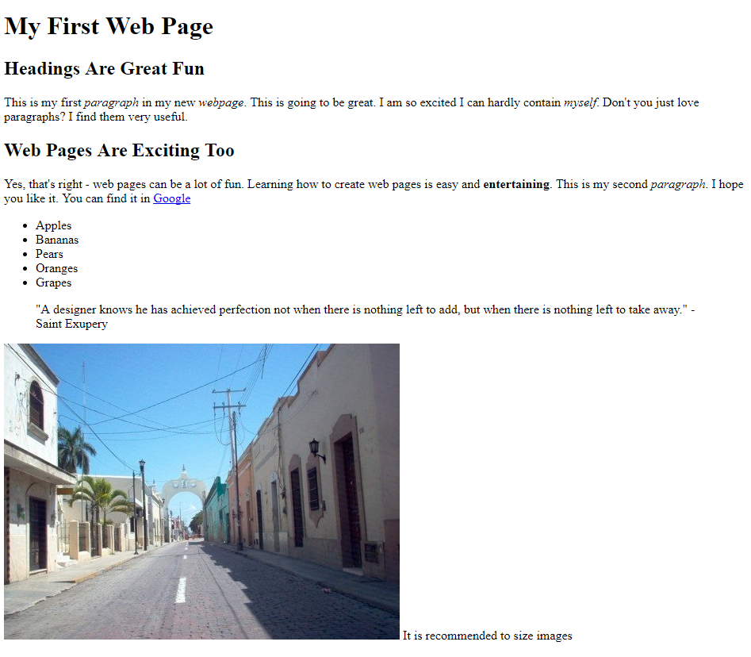
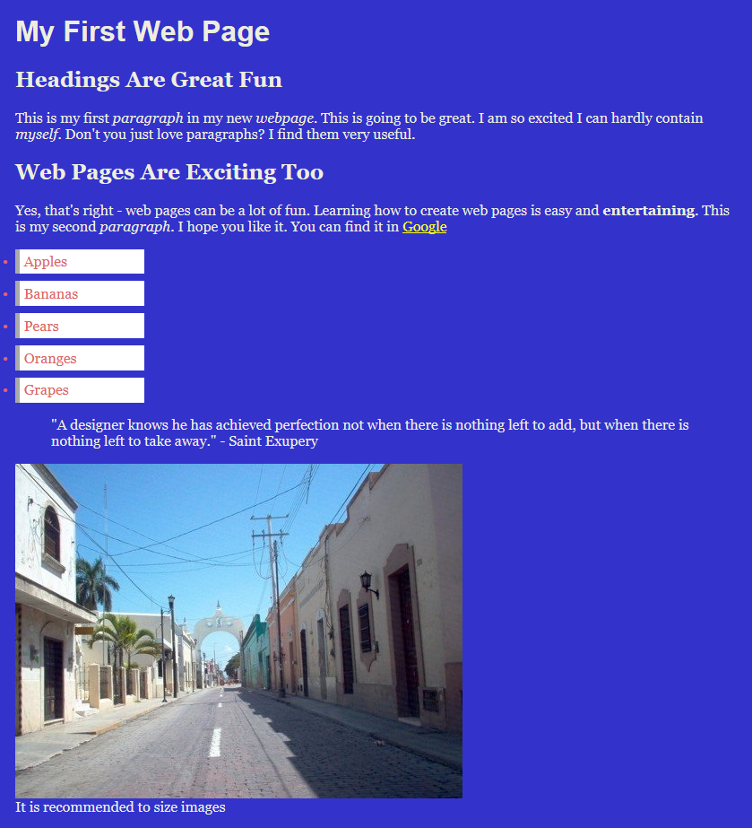
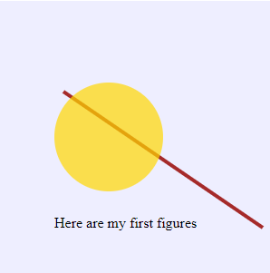
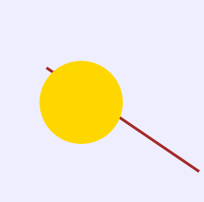

## Exercices

### HTML

Write the HTML code to create the following page (no styles, no scripting) with HTML tags: 
 + &lt;h1&gt; - &lt;h6&gt; Heading; 
 + &lt;p&gt;	Paragraph; 
 + &lt;a&gt;	Anchor; 
 + &lt;ul&gt; and &lt;li&gt; Unordered List & List Item; 
 + &lt;blockquote&gt; Blockquote; 
 + &lt;img&gt; Image and 
 + &lt;div&gt; Division
 

 
### CSS

Style the previous HTML page trying to imitate the following appearance:

### SVG

Replicate this drawing and text with SVG on an HTML page

 

### Javascript and D3

Starting from the basic HTML page, recreate a simplified version of the previous SVG code through appending elements to the code. 

 
 

